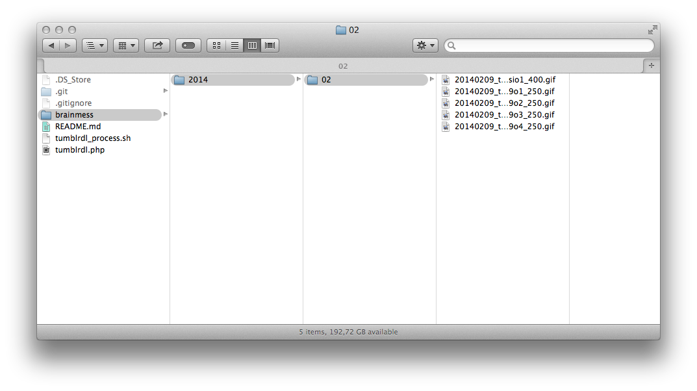

# TumblrDownloader

| Console | Finder |
|:-------:|:------:|
|  |  |

Enables batch download of a [Tumblr](http://www.tumblr.com/) blog using the [official API](http://www.tumblr.com/api/).

For more information use the source, Luke!.

#### Important note

In order for the script to work you need to register an app on the [Tumblr API](http://www.tumblr.com/oauth/apps) (it only takes seconds) and then replace the value in the script.

	define('API_KEY', 'REPLACE_ME');

## Usage

### Basic

Run the following command in a terminal:

	php tumblrdl.php -b blog_name

Replace blog_name by the desired blog name (e.g. brainmess).

### Advanced
Several options are available, for detailed help and usage examples run the following command:

	php tumblrdl.php -h (or --help)
	
Output:

	Usage: php tumblrdl.php -b <blog_name>

	-b <blog_name> (or --blog <blogname>)	*required* the blog name (e.g 'brainmess')
	-o=<offset> (or --offset=<offset>)	*optional* the number of posts to skip before starting download (e.g. 100)
	-l=<limit> (or --limit=<limit>)		*optional* the number of post parsed in each run - by default 20 (e.g. 50)
	-d=<path> (or --directory=<path>)	*optional* the path to the download directory - by default script directory (e.g. /Users/username/Desktop)
	-u (or --unlimited)			*optional* a flag to tell the script to download every photo available (might take a while ^^)
	-c (or --continue)			*optional* a flag to tell the script to continue even if it encounters existing files
	-h (or --help)				*help* print this help
	--wallfilter				apply filter for only downloading photos that might be used as wallpapers (checks: landscape, ratio, dimensions)
	--blacklist=<gif,webm>			extensions of files NOT to download (separated by commas (,) with no space)
	--whitelist=<jpg,png>			extensions of files to download (separated by commas (,) with no space)

	Call examples:

	php tumblrdl.php -b brainmess -u (download every photo available)
	php tumblrdl.php -b brainmess -l=50 (download the last 50 photos)
	php tumblrdl.php -b brainmess --wallfilter --whitelist=jpg,png (download photos with extension jpg or png that are fit for being wallpapers)
	php tumblrdl.php --blog brainmess --offset=100 --limit=50 --directory=/Users/username/Desktop (download 50 photos on the desktop by skipping the last 100 posts)
	...

	Notes:

	- short and long options can be used interchangeably (if available)
	- do not specify an option more than once (unexpected behavior might occur)
	- the 'offset' and 'limit' refers to the post count, not the photo count (!) as there may be more than one photo in a post.
	- download directory path must be absolute (/Users/username/Desktop instead of ~/Desktop)
	- once the script encounters an already downloaded photo (test for an existing file) it will stop (except when -c or --continue option is used)
	- if the original photo is not available, the script try an download the next available bigger size.
	- photos are downloaded following this architecture path_to_download_directory/blog_name/yyyy/mm/yyyymmdd_basename.extension
	- if you use filters (wallfilter, black/whitelist) you may end up with empty folders as they are created before the download (room for improvement).

	Black/White list:

	- the script checks first if the file's extensions is in the blacklist and then in the whitelist therefore if you both allow and deny an extension it will be denied!
	- the script converts extension to lowercase so you don't have to worray wheter it is JPG or jpg...

## FAQ

See the [Wiki FAQ page](https://github.com/saeros/tumblrdl/wiki/FAQ).

## TODO

* <s>Create a TODO list</s>;
* <s>Whitelist / blacklist of accepted file extensions (e.g. forbiding `.gif` files).</s>

## License

See the `LICENSE` file.

## Contributing

You know the drill:

1. Fork
2. Modify
3. Pull request
