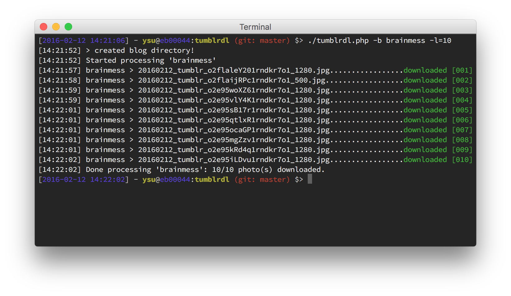

  

# TumblrDownloader

Enables batch download of a [Tumblr](http://www.tumblr.com/) blog using the [official API](http://www.tumblr.com/api/).

## Usage

### Basic

* Open a terminal pointed at the script folder
* Make sure the script is executable (`chmod +x`)

Then run:

	./tumblrdl.php -b blog_name

Replace blog_name by the desired blog name (e.g. brainmess).

### Advanced

Several options are available, for detailed help and usage examples run the following command:

	./tumblrdl.php -h (or --help)
	
Output:

	Usage: ./tumblrdl.php -b <blog_name>
	
	  -b <blog_name> (or --blog <blogname>)  *required* the blog name (e.g 'brainmess')
	  -o=<offset> (or --offset=<offset>)     *optional* the number of posts to skip before starting download (e.g. 100)
	  -l=<limit> (or --limit=<limit>)        *optional* the number of post parsed in each run - by default 20 (e.g. 50)
	  -d=<path> (or --directory=<path>)      *optional* the path to the download directory - by default script directory (e.g. /Users/username/Desktop)
	  -u (or --unlimited)                    *optional* a flag to tell the script to download every photo available (might take a while ^^)
	  -c (or --continue)                     *optional* a flag to tell the script to continue even if it encounters existing files
	  --wallfilter                           *optional* apply filter for only downloading photos that might be used as wallpapers (checks: landscape, ratio, dimensions)
	  --blacklist=<extensions>               *optional* extensions of files NOT to download (separated by commas (,) with no space)
	  --whitelist=<extensions>               *optional* extensions of files to download (separated by commas (,) with no space)
	  -h (or --help)                         prints this help
	
	Examples:
	
	  ./tumblrdl.php -b brainmess -u (download every photo available)
	  ./tumblrdl.php -b brainmess -l=50 (download the last 50 photos)
	  ./tumblrdl.php -b brainmess --wallfilter --whitelist=jpg,png (download photos with extension jpg or png that are fit for being wallpapers)
	  ./tumblrdl.php --blog brainmess --offset=100 --limit=50 --directory=/Users/username/Desktop (download 50 photos on the desktop by skipping the last 100 posts)
	  ...
	
	Notes:
	
	  - configuration resides in the config.json file
	  - the 'offset' and 'limit' refers to the post count, not the photo count (!) as there may be more than one photo in a post.
	  - download directory path must be absolute (/Users/username/Desktop instead of ~/Desktop)
	  - once the script encounters an already downloaded photo (test for an existing file) it will stop (except when -c or --continue option is used)
	  - if the original photo is not available, the script try an download the next available bigger size.
	  - photos are downloaded following this architecture path_to_download_directory/blog_name/yyyy/mm/yyyymmdd_basename.extension
	  - if you use filters (wallfilter, black/whitelist) you may end up with empty folders as they are created before the download (room for improvement).
	  - the script checks first if the file's extension is in the blacklist and then in the whitelist therefore if you both allow and deny an extension it will be denied.
	  - the script converts extension to lowercase so you don't have to worry whether it is JPG or jpg...

## Configuration

In order for the script to work you need to register an app on the [Tumblr API](http://www.tumblr.com/oauth/apps) (it only takes seconds), then rename the `config-example.json` to `config.json` and replace the values:

* API_KEY

## FAQ

See the [Wiki FAQ page](https://github.com/saeros/tumblrdl/wiki/FAQ).

